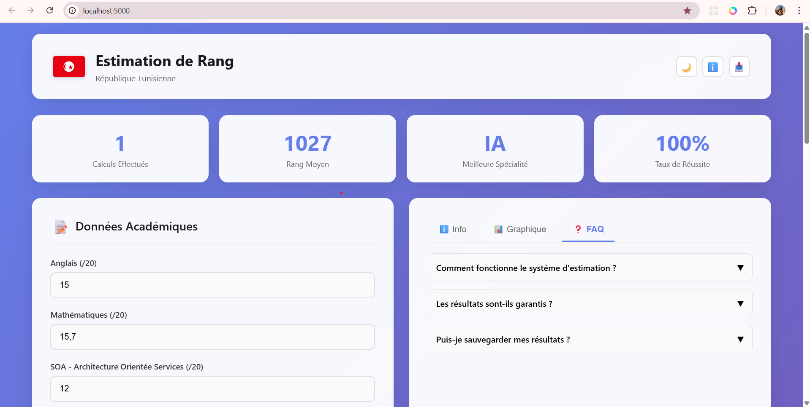

# smart-rank-projet-estimation-de-rang
Estimation de Rang est un projet intelligent basé sur le Machine Learning (KNN) qui permet aux étudiants tunisiens d’estimer leur rang académique via une application web et un bot Telegram à partir de leurs résultats scolaires.
# 🎓 Estimation de Rang – Machine Learning & Telegram Bot

## 📌 Description du projet

**Estimation de Rang** est un projet académique basé sur le **Machine Learning (K-Nearest Neighbors – KNN)** qui permet aux étudiants d’estimer leur **rang académique** à partir de leurs résultats scolaires.

Le système est accessible via une **application web** et un **bot Telegram**, offrant une solution **simple, rapide et interactive**.

Ce projet vise à aider les étudiants à mieux comprendre leur position académique et à prendre des décisions éclairées pour leur avenir universitaire.

---

## 🎯 Objectifs du projet

- Aider les étudiants à estimer leur rang académique  
- Réduire le stress lié à l’incertitude du classement  
- Offrir une solution numérique moderne et accessible  
- Appliquer un algorithme de Machine Learning simple et efficace  
- Proposer une interface web et un bot Telegram intuitifs  

---

## 🤖 Algorithme utilisé

- **K-Nearest Neighbors (KNN) – Régression**
- Distance utilisée : **distance euclidienne**
- Pondération : **distance-based weighting**

### Modèles spécialisés :
- AI  
- Logic  
- Network  
- Software  

Chaque modèle prédit le rang académique selon la spécialité choisie.

---

## 📊 Données utilisées

- **Fichier** : `rankdata.xlsm`
- Contient les notes des étudiants et leurs rangs réels
- Moyennes calculées de manière pondérée selon la spécialité
- Dataset statique (pas une base de données dynamique)

---

## 🛠️ Technologies utilisées

### 🔹 Backend & Machine Learning
- Python  
- Flask  
- Scikit-learn  
- Pandas  
- NumPy  
- Pickle  

### 🔹 Interfaces
- HTML / CSS / JavaScript  
- Chart.js  
- Telegram Bot API  

---

## 💬 Pourquoi un bot Telegram ?

- Facile à utiliser (sans installation)
- Accessible sur mobile et PC
- Interaction rapide et intuitive
- Très populaire chez les étudiants
- Réponses instantanées

## 📷 Captures d’écran du projet

### 🌐 Interface Web – Estimation de Rang
Cette interface permet à l’étudiant de saisir ses notes, de choisir sa spécialité
et d’obtenir une estimation claire de son rang académique.

---

### 🤖 Bot Telegram – Interaction utilisateur
Le bot Telegram offre une interaction rapide et intuitive pour estimer le rang
académique sans passer par une application web.

---

### 📊 Résultats & Visualisation des prédictions
Les résultats sont présentés sous forme de scénarios (optimiste, réaliste,
pessimiste) avec une visualisation graphique claire et compréhensible.

---

